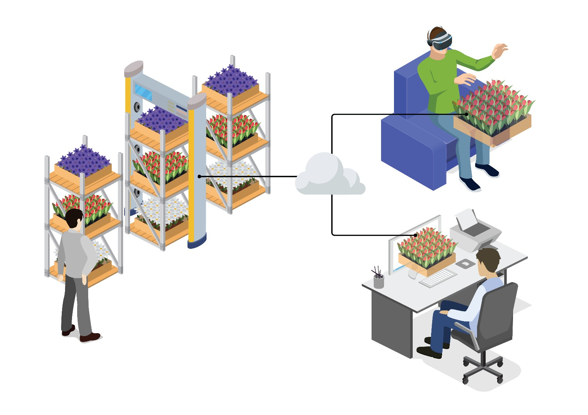
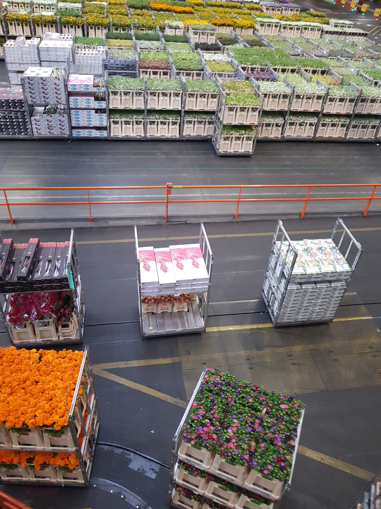

# Flowers Mixed Reality 

## **Why:**

This system aims to quickly spot which box includes what percentage of unhealthy flowers.

## **What:**

They have several boxes with flowers. Their pattern is uniform when all flowers are healthy. However if there are dead flowers, that area on the box looks non-uniform.

## **How:** 

### Task List:

- [X] Design Low fidelity Prototype images 
- [ ] Write conceptual text
- [ ] Design High Fidelity prototype
- [ ] Add Multiverse Code
- [ ] Add boxes
- [ ] Add track lanes
- [ ] Move boxes
- [ ] Add images/ 3d models
- [ ] Deploy on Gh pages
- [ ] Send for validation

