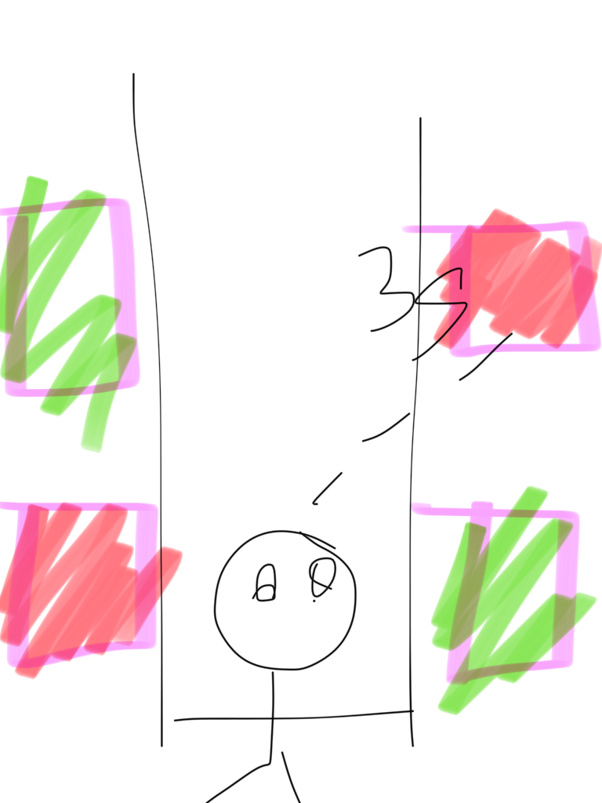
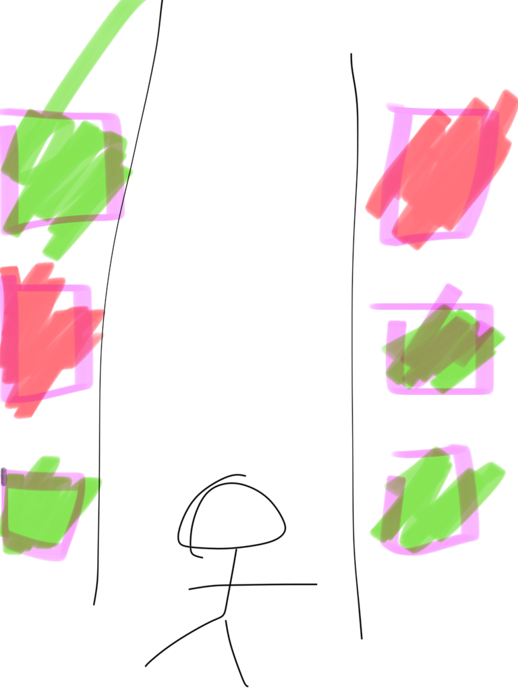
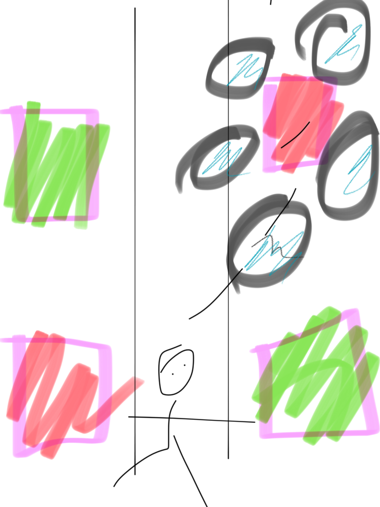

# Concept Design

This mixed-reality system is a new way to explore flowers. Using state of the art technologies, the system improves how we analyze and visualize flowers, with their health and vitality being a tangible information. 

Visualizing this is the first step to get insights on how to improve the general process in the factory.

Boxes are organized by allotment or type. Each box has smaller flower cubes. A scanner will take pictures of the boxes, uploading them to a database on the cloud. Later on, a machine learning model will extract features for inteligence analisis. Features are informations such as their color and health percentage.

With the informations available, now comes the visualization step. This whole system includes three sub-systems: One machine learning model to understand the data, one virtual reality system to visualize the data, and one augmented reality system to expand the limits and acquire insights.

**The Machine Learning Model:** 

Lorem ipsum dolor sit amet, consectetur adipiscing elit. Nam luctus feugiat massa, et hendrerit tortor mollis eget. Nulla ultricies mi in eros convallis, a mollis elit sagittis. Praesent tincidunt id sapien nec lobortis. Nunc gravida, odio non interdum tempus, est eros consequat lorem, sit amet finibus velit erat sed est.

Quisque id faucibus nulla, in porttitor risus. Etiam eget viverra nisi. Aenean efficitur tristique enim, ut viverra sem aliquet a. Aliquam erat volutpat. In ac euismod dui. Mauris non nisi tortor. Sed viverra pretium justo quis interdum. Aenean et auctor diam. Nam pretium ultrices massa at feugiat. 

Curabitur condimentum at mauris non cursus. Aenean iaculis, ex eu iaculis mollis, risus metus interdum nisi, sodales consequat mauris diam vitae magna. Praesent euismod porttitor metus, et ornare justo hendrerit at. 

**The VR:**

Lorem ipsum dolor sit amet, consectetur adipiscing elit. Nam luctus feugiat massa, et hendrerit tortor mollis eget. Nulla ultricies mi in eros convallis, a mollis elit sagittis.

The virtual reality system immerse the user on a corridor with 3D shapes on both sides. The interface is gaze controlled, this means that when we gaze an option for more than 3 seconds, we select it. 

Initially, the user has 3 options: Start, Stop, Or choose a box. 

If the user selects the start option, the flowers begin running on on both side tracks. If the user gaze at the stop option, the tracks stop. And if the user gaze at a specific box for more than 3 seconds, then the system brings this chosen box for a closer observation, moving it to the front and opening a secondary interface with all the data about the box of flowers.

**The AR:**

As a way of expanding information into an augmented reality system, Lorem ipsum dolor sit amet, consectetur adipiscing elit. Nam luctus feugiat massa, et hendrerit tortor mollis eget. 

Nulla ultricies mi in eros convallis, a mollis elit sagittis. Praesent tincidunt id sapien nec lobortis. Nunc gravida, odio non interdum tempus, est eros consequat lorem, sit amet finibus velit erat sed est.

Quisque id faucibus nulla, in porttitor risus. Etiam eget viverra nisi. Aenean efficitur tristique enim, ut viverra sem aliquet a. Aliquam erat volutpat. In ac euismod dui. Mauris non nisi tortor. Sed viverra pretium justo quis interdum. Aenean et auctor diam. Nam pretium ultrices massa at feugiat. 

